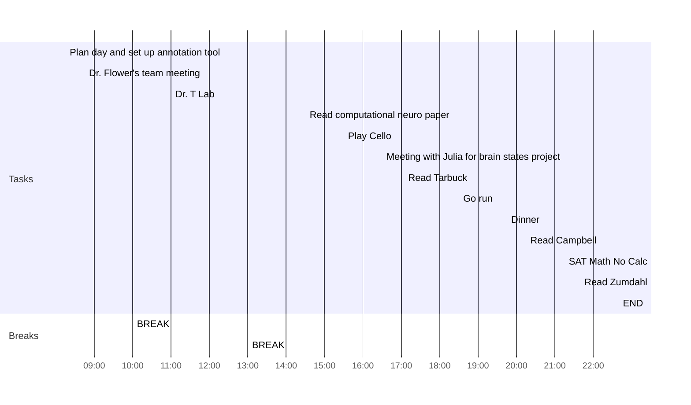

date: 08.17.2022
time: 07:45
tags: 
# What do I have to do today?

## Tasks
- [x] Do Latin Anki Flashcards ✅ 2022-08-17
- [x] Read [[Generative Models of Brain Dynamics]] and take notes/annotate 📅 2022-08-18
- [x] Read part of Tarbuck Chapter 1
- [x] Read Campbell chap 9
- [x] Read chapter 3 Zumdahl
## My Day
- [x] 08:15 Plan day and set up annotation tool
- [x] 08:45 Dr. Flower's team meeting
- [x] 10:00 BREAK
- [x] 11:00 Dr. T Lab
- [x] 13:00 BREAK
- [x] 14:30 Read computational neuro paper
- [x] 15:30 Play Cello
- [x] 16:30 Meeting with Julia for brain states project
- [x] 17:05 Read Tarbuck
- [x] 18:30 Go run
- [x] 19:45 Dinner
- [x] 20:15 Read Campbell
- [x] 21:15 SAT Math No Calc
- [x] 21:40 Read Zumdahl
- [x] 22:40 END