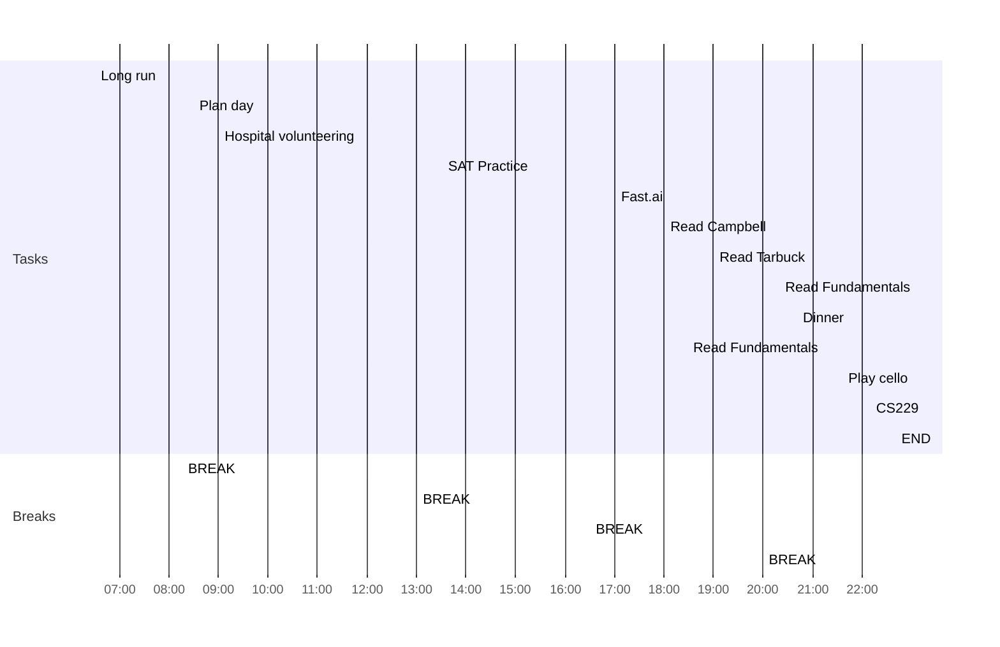

date: 08.20.2022
time: 08:39
tags: 
# What do I have to do today?

## Tasks
- [x] Do full set SAT
- [x] Finish watching fast.ai lesson 3
- [x] Read Campbell chapter 10
- [x] Read Fundamentals chapter 10
- [x] Read Tarbuck chapter 22
- [x] Lecture 1 CS229
- [x] Play with gggenomes and genemodels packages #task 🛫 2022-08-20 📅 2022-08-26
- [x] Play with imager package for ML problem #task 🛫 2022-08-20 📅 2022-08-26
- [x] Start working on deep learning model #task 🛫 2022-08-20 📅 2022-08-26
## Day Planner
- [x] 06:30 Long run
- [x] 08:15 BREAK
- [x] 08:30 Plan day
- [x] 09:00 Hospital volunteering
- [x] 13:00 BREAK
- [x] 13:30 SAT Practice
- [x] 16:30 BREAK
- [x] 17:00 Fast.ai
- [x] 18:00 Read Campbell
- [x] 19:00 Read Tarbuck
- [x] 20:00 BREAK
- [x] 20:20 Read Fundamentals
- [x] 20:40 Dinner
- [x] 21:15 Read Fundamentals
- [x] 21:35 Play cello
- [x] 22:10 CS229
- [x] 22:40 END