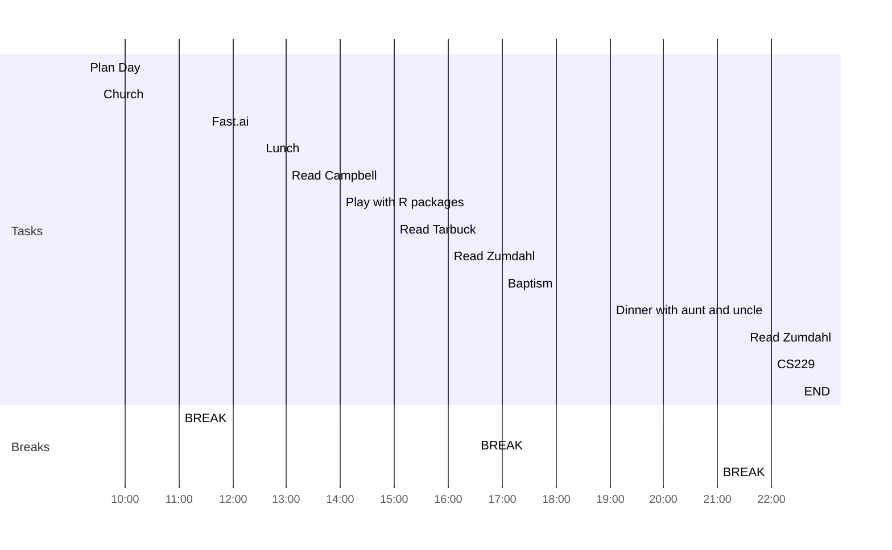

date: 2022-08-21
time: 09:20
tags: 
# What do I have to do today?
## Tasks
### To-do From Yesterday:
```tasks
(not done) AND (starts on yesterday)
hide start date
hide edit button
short mode
```
### Today:
- [x] Finish following along fast.ai 3rd lesson #task 🛫 2022-08-21
- [x] Read Campbell chapter 10 #task 🛫 2022-08-21
- [x] Read Zumdahl chapter 4 #task 🛫 2022-08-21
- [x] Read Tarbuck chapter 22 #task 🛫 2022-08-21
## Day Planner


- [x] 09:15 Plan Day
- [x] 09:30 Church
- [x] 11:00 BREAK
- [x] 11:30 Fast.ai
- [x] 12:30 Lunch
- [x] 13:00 Read Campbell
- [x] 14:00 Play with R packages
- [x] 15:00 Read Tarbuck
- [x] 16:00 Read Zumdahl
- [x] 16:30 BREAK
- [x] 17:00 Baptism
- [x] 19:00 Dinner with aunt and uncle
- [x] 21:00 BREAK
- [x] 21:30 Read Zumdahl
- [x] 22:00 CS229
- [x] 22:30 END