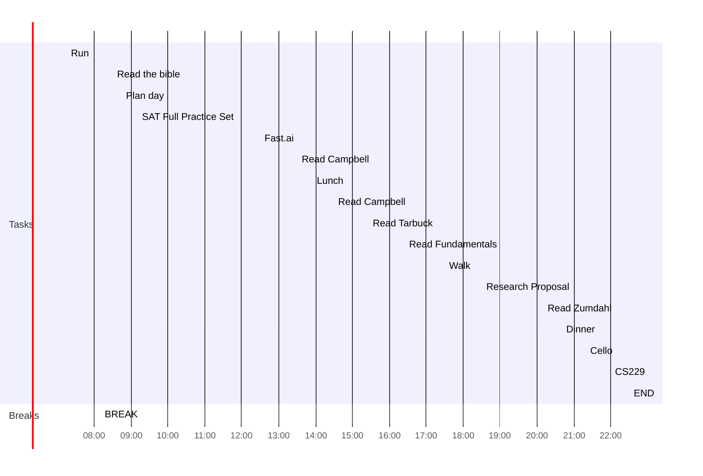

date: 2022-08-22
time: 08:49
tags: 
# What do I have to do today?
## Tasks
### Leftovers
```tasks
(not done) AND (starts before today)
hide start date
hide edit button
short mode
```
### For Today
- [x] Do one full SAT practice test
- [x] Read Campbell chapter 11 #task 🛫 2022-08-22
- [x] Watch Fast.ai lesson 4 #task 🛫 2022-08-22
- [x] Read Tarbuck chapter 21 #task 🛫 2022-08-22
- [x] Read Fundamentals chapter 10 #task 🛫 2022-08-22
- [x] Read Zumdahl chapter 4 #task 🛫 2022-08-22
- [x] Finalize and turn in research proposal #task 🛫 2022-08-22 📅 2022-08-22

## Day Planner


- [x] 07:15 Run
- [x] 08:10 BREAK
- [x] 08:30 Read the bible
- [x] 08:45 Plan day
- [x] 09:10 SAT Full Practice Set
- [x] 12:30 Fast.ai
- [x] 13:30 Read Campbell
- [x] 13:55 Lunch
- [x] 14:30 Read Campbell
- [x] 15:25 Read Tarbuck
- [x] 16:25 Read Fundamentals
- [x] 17:30 Walk
- [x] 18:30 Research Proposal
- [x] 20:10 Read Zumdahl
- [x] 20:40 Dinner
- [x] 21:20 Cello
- [x] 22:00 CS229
- [x] 22:30 END