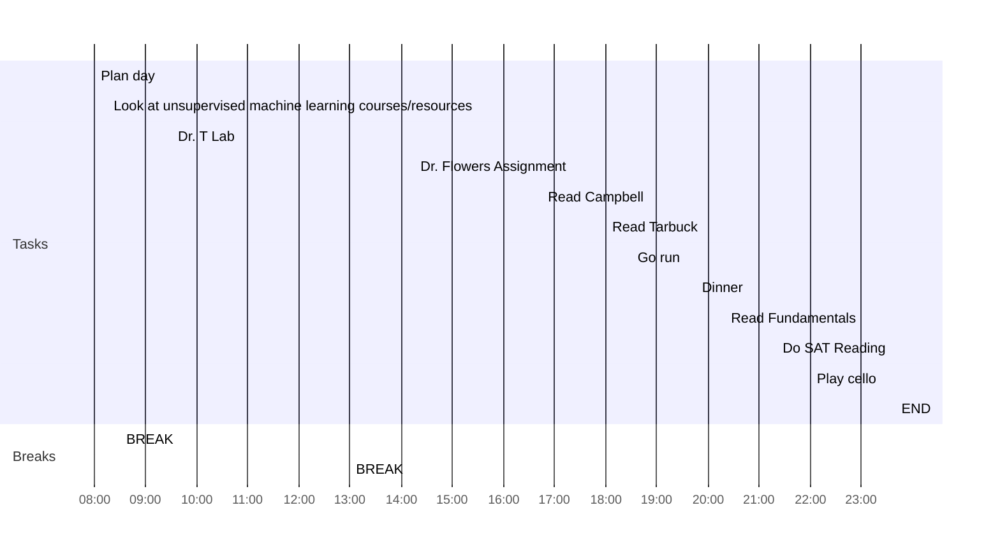

date: 08.18.2022
time: 07:38
tags: 
# What do I have to do today?

## Tasks
- [x] Dr. Flowers' Assignment:
	- [x] Interpro characterize MOC1, Tb1, and Tin1 proteins from date palm (create slide) and determine if Tb1 has the motif characterized in maize and arabidopsis
	- [x] Play around with graphics software (gggenome and genemodel)
	- [x] Identify an R package that will read image and report R, G, B values per pixel
		- Look at U-Net for image segmentation
- [x] Read Campbell Ch 9 and 10
- [x] Read Fundamentals
- [x] Read Tarbuck ch 1
- [x] SAT Reading
## My Day
- [x] 08:00 Plan day
- [x] 08:15 Look at unsupervised machine learning courses/resources
- [x] 08:30 BREAK
- [x] 09:30 Dr. T Lab
- [x] 13:00 BREAK
- [x] 14:15 Dr. Flowers Assignment
- [x] 16:45 Read Campbell
- [x] 18:00 Read Tarbuck
- [x] 18:30 Go run
- [x] 19:45 Dinner
- [x] 20:20 Read Fundamentals
- [x] 21:20 Do SAT Reading
- [x] 22:00 Play cello
- [x] 23:40 END