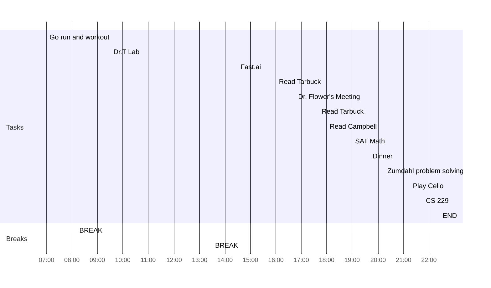

date: 08.19.2022
time: 08:16
tags: 
# What do I have to do today?

## Tasks
- [x] Finish Fast.ai second lesson
- [x] Read Campbell ch 10
- [x] Finish Tarbuck ch 1
- [x] Do Zumdahl ch 3 problems
- [x] Read Fundamentals ch 10
- [x] Start CS229 Stanford course
- [x] SAT Math
## My Day
- [x] 07:00 Go run and workout
- [x] 08:10 BREAK
- [x] 09:30 Dr.T Lab
- [x] 13:30 BREAK
- [x] 14:30 Fast.ai
- [x] 16:00 Read Tarbuck
- [x] 16:45 Dr. Flower's Meeting
- [x] 17:40 Read Tarbuck
- [x] 18:00 Read Campbell
- [x] 19:00 SAT Math
- [x] 19:40 Dinner
- [x] 20:15 Zumdahl problem solving
- [x] 21:15 Play Cello
- [x] 21:45 CS 229
- [x] 22:25 END