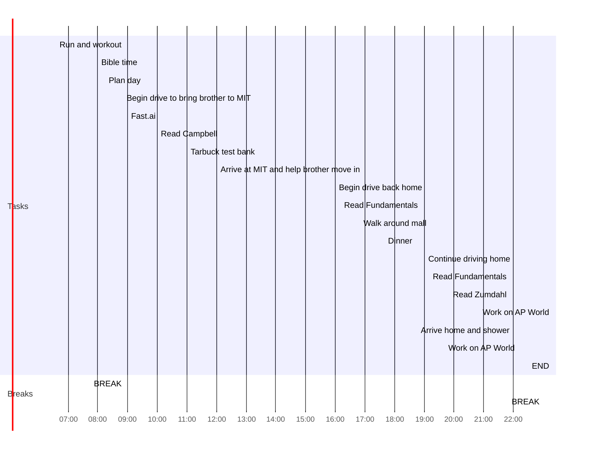

date: 2022-08-23
time: 08:12
tags: 
# What do I have to do today?
## Tasks
### Leftovers
```tasks
(not done) AND (starts before today)
hide start date
hide edit button
short mode
```
### For Today
- [ ] Complete AP World Outline up to chapter 2 #task 🛫 2022-08-23 📅 2022-08-24 
- [x] Read Campbell chapter 11 #task 🛫 2022-08-23
- [x] Do Tarbuck test bank for ch 1 and 22 #task 🛫 2022-08-23
- [x] Read Fundamentals chapter 11 #task 🛫 2022-08-23
- [x] Read Zumdahl chapter 4 #task 🛫 2022-08-23
- [x] Finish watching Fast.ai lesson 4 and follow along #task 🛫 2022-08-23
## Day Planner


- [x] 06:35 Run and workout
- [x] 07:45 BREAK
- [x] 08:00 Bible time
- [x] 08:15 Plan day
- [x] 08:50 Begin drive to bring brother to MIT
- [x] 09:00 Fast.ai
- [x] 10:00 Read Campbell
- [x] 11:00 Tarbuck test bank
- [x] 12:00 Arrive at MIT and help brother move in
- [x] 16:00 Begin drive back home
- [x] 16:10 Read Fundamentals
- [x] 16:50 Walk around mall
- [x] 17:40 Dinner
- [x] 19:00 Continue driving home
- [x] 19:10 Read Fundamentals
- [x] 19:50 Read Zumdahl
- [x] 20:50 Work on AP World
- [x] 21:50 BREAK
- [x] 22:00 Arrive home and shower
- [x] 22:10 Work on AP World
- [x] 22:30 END